

# 🎵 NB SOUND

### Un catalogador inteligente de música local

Identifica, etiqueta, organiza y enriquece tu colección de audio.

Todo local. Sin nube. Sin suscripciones. Sin vender tus datos.

  <i>🛡️ Privado • ⚡ Inteligente • 🎧 Hecho para bibliotecas reales</i>

 

 

  

[🌐 Página Web](https://nbsound.up.railway.app/)

[📖 Documentación](docs/installation.md)

[🐞 Reportar un Bug](https://github.com/Nate-1296/NB-SOUND/issues)

---

# 📸 Vista previa

## 🏠 Inicio

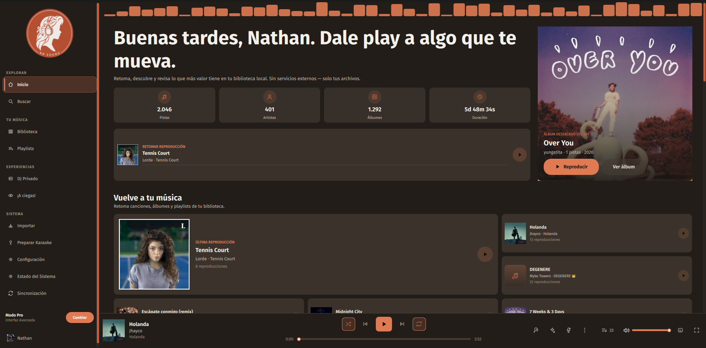

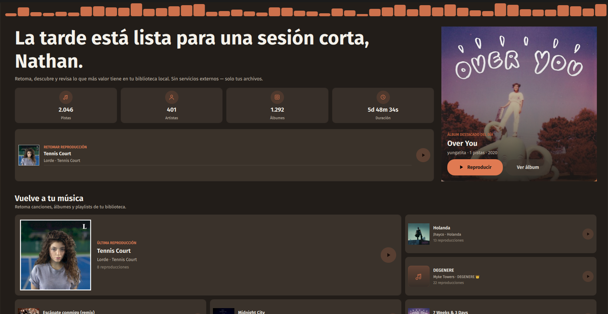

---

## 🎵 Biblioteca

### Álbumes

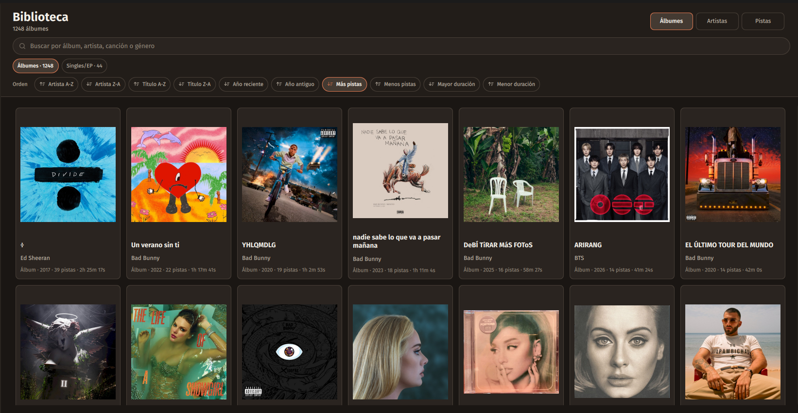

### Artistas

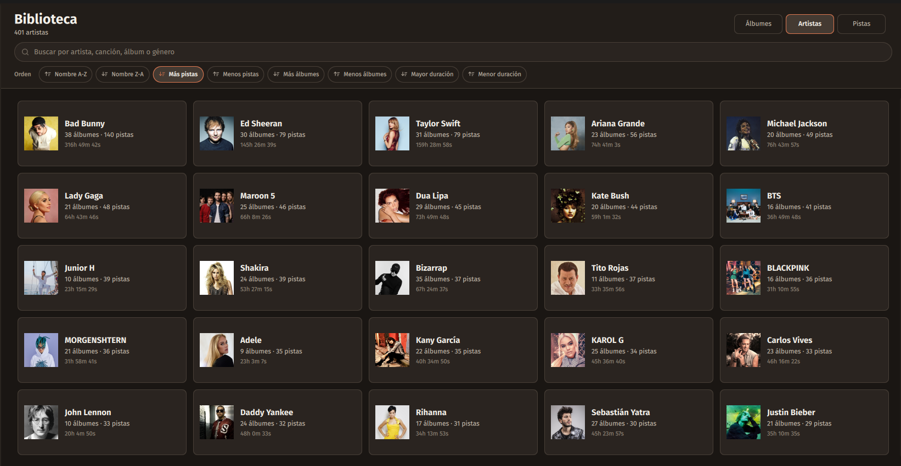

### Pistas

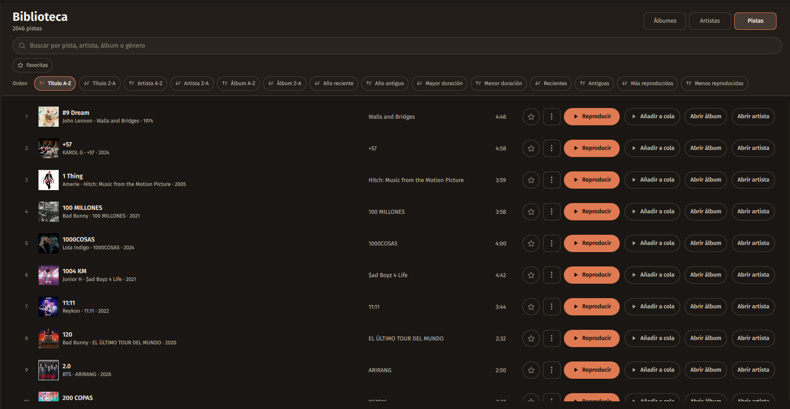

---

## ▶️ Reproductor

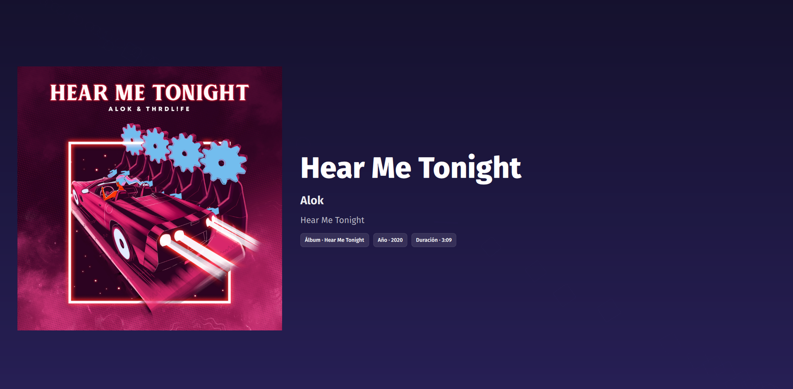

---

## 📂 Importación

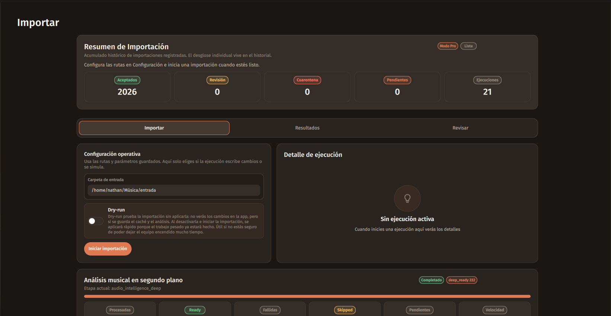

---

## 🔎 Búsqueda

### Búsqueda tradicional

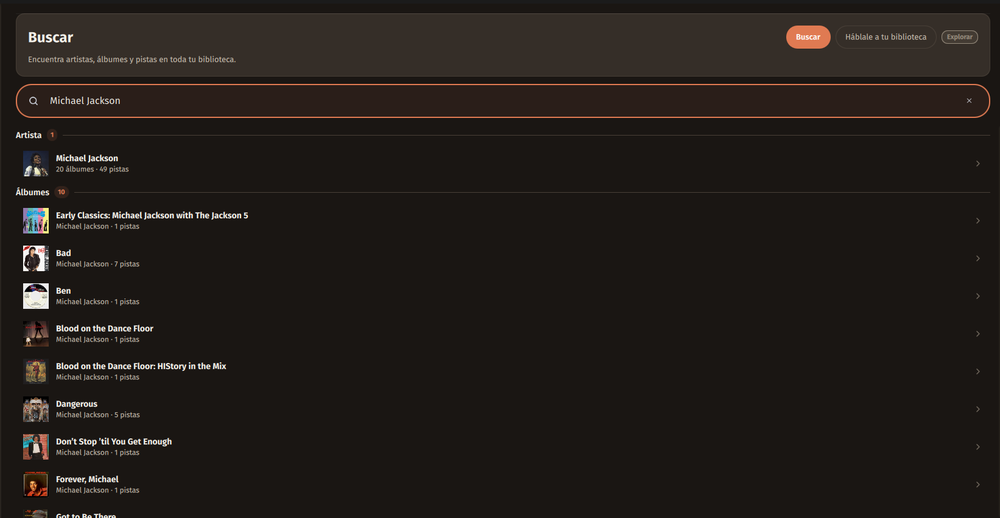

### Búsqueda inteligente

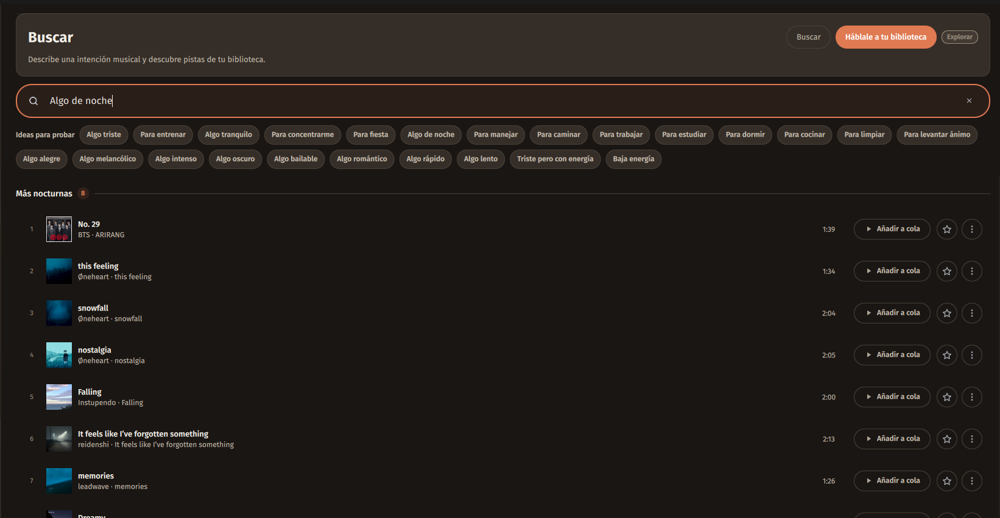

---

## 🎚️ DJ Privado

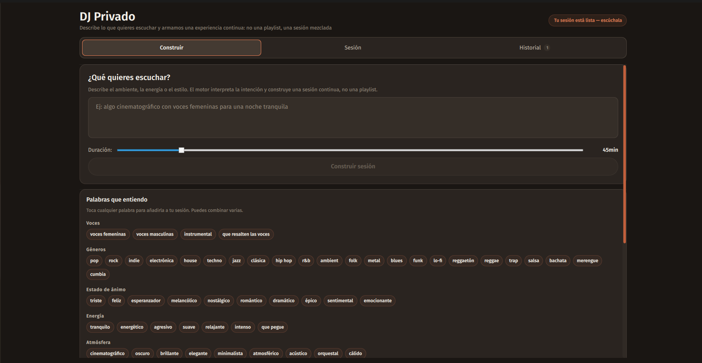

---

## 🎤 Karaoke

### Preparación

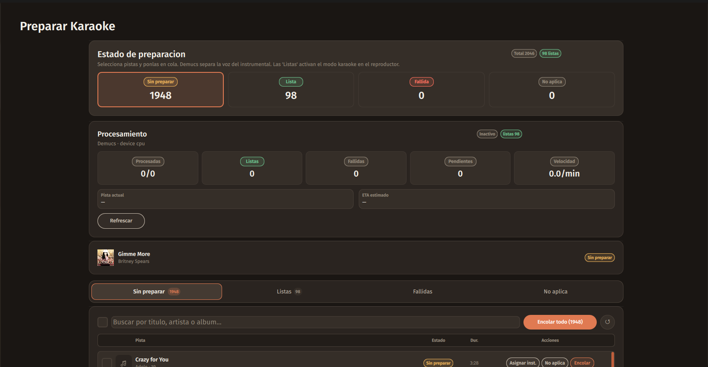

### Karaoke activo

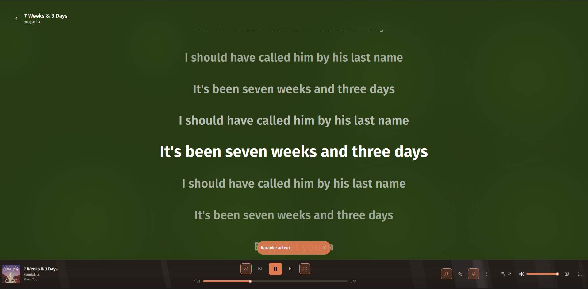

---

## 🎲 Explorador Ciego

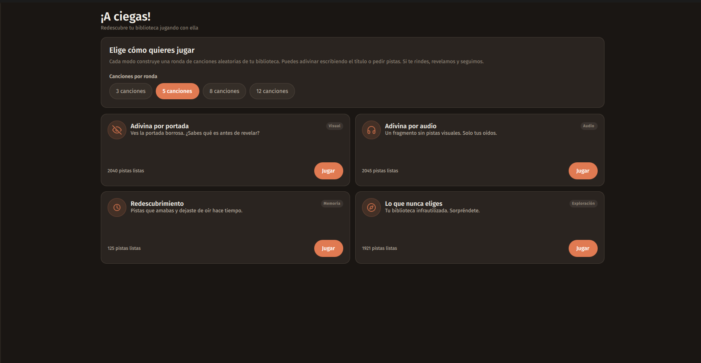

---

## 📜 Cola de reproducción

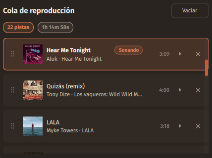

---

## 📝 Playlists

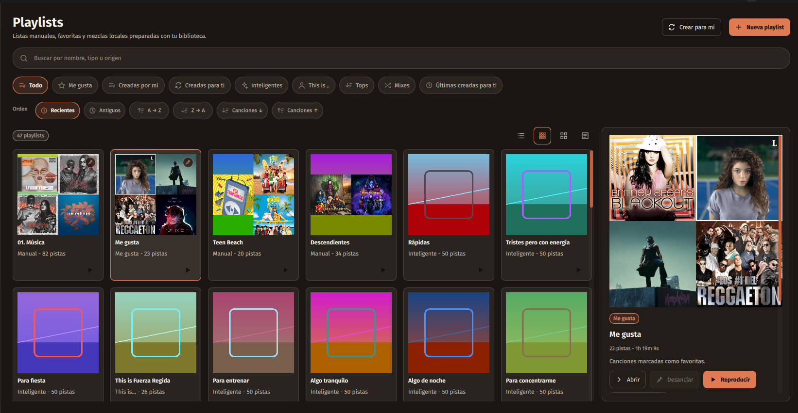

---

## 👤 Perfil y estadísticas

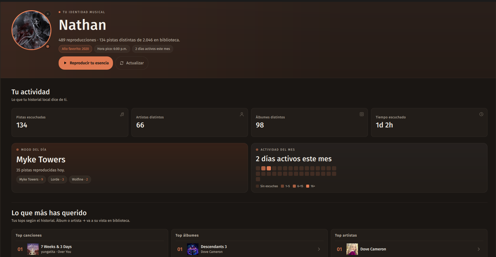

---

## ⚙️ Configuración

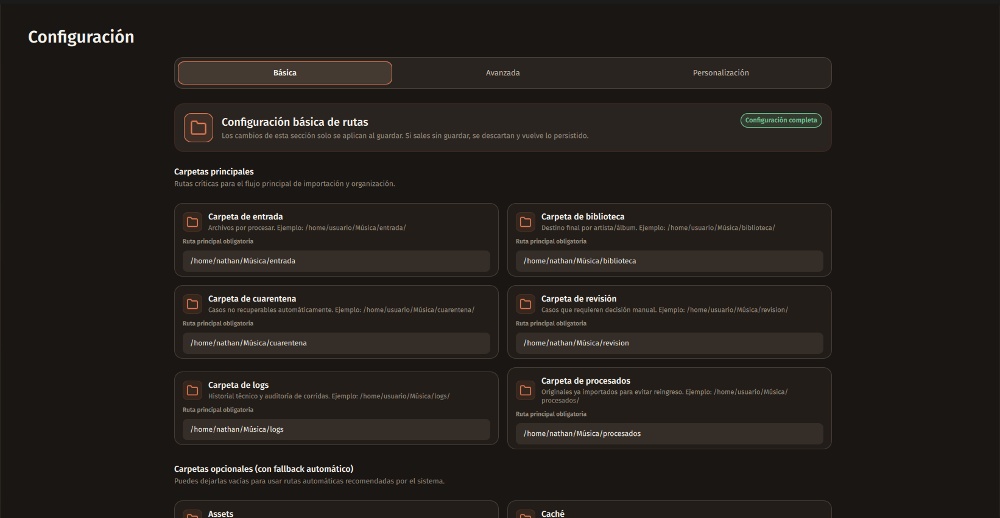

---

## 🩺 Estado del sistema

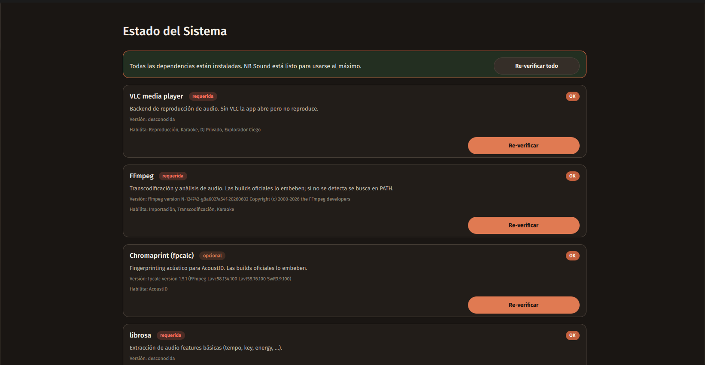

---

# ✨ ¿Qué es NB SOUND?

NB SOUND convierte carpetas caóticas llenas de archivos de audio en una biblioteca organizada, enriquecida y reproducible.

Combina:

* 🧠 Identificación inteligente
* 🏷️ Reescritura segura de metadata
* 🎵 Reproductor moderno
* 🎤 Karaoke local con IA
* 🎚️ DJ automático
* 📊 Estadísticas personales
* 🔎 Búsqueda natural
* 🎲 Exploración gamificada

Todo funcionando localmente.

Sin depender de servidores externos para administrar tu colección.

---

# 🚀 Inicio rápido

## 📦 Instalar una release

Descarga la versión más reciente desde:

👉 [https://github.com/Nate-1296/NB-SOUND/releases](https://github.com/Nate-1296/NB-SOUND/releases)

> 💡 Los bundles ya incluyen:
>
> * FFmpeg
> * ffprobe
> * fpcalc
>
> Solo necesitas tener VLC instalado para reproducción de audio.

---

# 🐧 Linux

<b>Debian / Ubuntu / Pop!_OS</b>

 
<pre class="overflow-visible! px-0!" data-start="2594" data-end="2649">

<pre class="cm-content q9tKkq_readonly m-0"><code>sudo apt install ./nb-sound_1.0.0_amd64.deb</code></pre>

</pre>

<b>Fedora / RHEL</b>

 
<pre class="overflow-visible! px-0!" data-start="2720" data-end="2778">

<pre class="cm-content q9tKkq_readonly m-0"><code>sudo dnf install ./nb-sound-1.0.0-1.x86_64.rpm</code></pre>

</pre>

<b>AppImage</b>

 
<pre class="overflow-visible! px-0!" data-start="2844" data-end="2928">

<pre class="cm-content q9tKkq_readonly m-0"><code>chmod+x NB_Sound-1.0.0-x86_64.AppImage ./NB_Sound-1.0.0-x86_64.AppImage</code></pre>

</pre>

<b>Portable</b>

 
Descomprime:
<pre class="overflow-visible! px-0!" data-start="3008" data-end="3051">

<pre class="cm-content q9tKkq_readonly m-0"><code>nb_sound-1.0.0-linux-x64.tar.gz</code></pre>

</pre>
Y ejecuta:
<pre class="overflow-visible! px-0!" data-start="3065" data-end="3087">

<pre class="cm-content q9tKkq_readonly m-0"><code>./nb_sound</code></pre>

</pre>

---

# 🪟 Windows

<b>Instalador</b>

 
Ejecuta:

<pre class="overflow-visible! px-0!" data-start="3184" data-end="3232">

<pre class="cm-content q9tKkq_readonly m-0"><code>nb-sound-1.0.0-windows-x64-setup.exe</code></pre>

</pre>

<b>Portable</b>

 
Descomprime:

<pre class="overflow-visible! px-0!" data-start="3312" data-end="3354">

<pre class="cm-content q9tKkq_readonly m-0"><code>nb_sound-1.0.0-windows-x64.zip</code></pre>

</pre>

Y ejecuta el programa.

---

# 🍎 macOS

<b>Instalador (.dmg)</b>

 
Monta:

<pre class="overflow-visible! px-0!" data-start="3478" data-end="3514">

<pre class="cm-content q9tKkq_readonly m-0"><code>NB_Sound-1.0.0-macos.dmg</code></pre>

</pre>

Y arrastra la app a `Applications`.

<b>Portable</b>

 
Descomprime:

<pre class="overflow-visible! px-0!" data-start="3631" data-end="3673">

<pre class="cm-content q9tKkq_readonly m-0"><code>nb_sound-1.0.0-macos-arm64.zip</code></pre>

</pre>

---

# 👨‍💻 Desarrollo

## Linux / macOS

<pre class="overflow-visible! px-0!" data-start="3730" data-end="3935">

<pre class="cm-content q9tKkq_readonly m-0"><code>git clone https://github.com/Nate-1296/NB-SOUND.git nb_sound  cd nb_sound  python3.12 -m venv .venv  source .venv/bin/activate  pip install -r requirements.txt  python main.py python main_ui.py</code></pre>

</pre>

---

## Windows (PowerShell)

<pre class="overflow-visible! px-0!" data-start="3967" data-end="4179">

<pre class="cm-content q9tKkq_readonly m-0"><code>git clone https://github.com/Nate-1296/NB-SOUND.git nb_sound  cd nb_sound  py -3.12 -m venv  .venv  .\.venv\Scripts\Activate.ps1  pip install -r requirements.txt  python main.py python main_ui.py</code></pre>

</pre>

---

# 🧠 Características principales

## 🎼 Catalogación inteligente

* Fingerprint acústico
* Integración con:
* AcoustID
* MusicBrainz
* Shazam
* Descarga automática de:
* metadata
* portadas
* letras
* Reescritura segura de tags ID3

---

## 🔁 Detección de duplicados

Detecta:

* Duplicados exactos mediante SHA256
* Duplicados semánticos mediante:
* ISRC
* `mb_recording_id`

Incluye pre-carga inteligente desde la biblioteca.

---

## 📊 Análisis de audio

Extrae automáticamente:

* BPM
* Energía
* Danceability
* Mood
* Vibe tags

También permite análisis profundo opcional con:

* Essentia
* TensorFlow

---

## 🖥️ Interfaz moderna

Construida con:

* PySide6
* QML

Incluye:

* Cola reordenable
* Letras sincronizadas
* Fullscreen player
* Mini player
* Actualización en vivo
* Gestión de playlists

---

## 🔎 Búsqueda natural

Busca cosas como:

> "algo triste pero energético"

o:

> "música relajante para estudiar de noche"

NB SOUND interpreta intención, no solo texto exacto.

---

# 🎤 Karaoke local con IA

Separación de:

* voz
* instrumental

usando:

* Demucs
* PyTorch

Todo ejecutado localmente.

Sin subir canciones a servidores externos.

---

# 🎚️ DJ Privado

Genera sesiones automáticas mezcladas dinámicamente.

Incluye:

* Beat matching
* EQ kill
* Barridos de filtro
* Transiciones automáticas
* Capas de stems de karaoke

Básicamente:

tu biblioteca se convierte en un mini club privado.

---

# 🎲 Explorador Ciego

Modo juego para redescubrir música olvidada.

Incluye desafíos como:

* adivinar canciones por portada borrosa
* reconocer fragmentos cortos
* explorar tracks nunca reproducidos

Tu disco duro escondiendo joyas desde 2017.

---

# 📚 Documentación

| Tema            | Documento                   |
| --------------- | --------------------------- |
| Instalación    | `docs/installation.md`    |
| Configuración  | `docs/configuration.md`   |
| Troubleshooting | `docs/troubleshooting.md` |
| CLI             | `docs/cli.md`             |
| UI              | `docs/ui.md`              |
| Karaoke         | `docs/karaoke.md`         |
| DJ Privado      | `docs/dj_privado.md`      |
| Arquitectura    | `docs/architecture.md`    |

---

# 🖥️ Plataformas soportadas

## Linux

* Ubuntu 22.04+
* Debian 12+
* Fedora 39+
* Arch Linux

---

## Windows

* Windows 10
* Windows 11

---

## macOS

* Intel
* Apple Silicon
* macOS 10.15+

---

# ⚙️ Requisitos mínimos

| Requisito       | Versión            |
| --------------- | ------------------- |
| Python          | 3.12                |
| VLC             | Requerido           |
| FFmpeg          | Incluido en bundles |
| RAM recomendada | 8 GB                |
| Karaoke IA      | GPU recomendada     |

---

# 🛡️ Privacidad

NB SOUND está diseñado con enfoque local-first.

Tu biblioteca:

* no se sube,
* no se sincroniza,
* no se vende,
* no se analiza en la nube.

La música sigue siendo tuya.

Concepto revolucionario en 2026, aparentemente.

---

# 🏗️ Arquitectura

NB SOUND separa claramente:

* 🧠 Motor CLI
* 🎨 UI
* 🎧 Reproducción
* 🔍 Indexación
* 📊 Features de audio
* 🎤 Karaoke
* 🎚️ Motor DJ

Esto permite:

* mantenimiento más limpio,
* procesamiento reanudable,
* observabilidad,
* recuperación ante fallos,
* futuras integraciones.

---

# 🧪 Estado del proyecto

> En desarrollo activo.

Las características principales ya son funcionales.

Los módulos avanzados continúan evolucionando.

---

# 📜 Licencia

GNU GPL v3.0 or later.

Consulta:

<pre class="overflow-visible! px-0!" data-start="7375" data-end="7394">

<pre class="cm-content q9tKkq_readonly m-0"><code>LICENSE</code></pre>

</pre>

---

# ❤️ Filosofía

NB SOUND existe porque depender completamente del streaming para escuchar música es una idea peligrosamente frágil.

Tu biblioteca local sigue siendo:

* más rápida,
* más privada,
* más personal,
* y más tuya.

---

## 🎧 NB SOUND

Tu música. Tus reglas.

